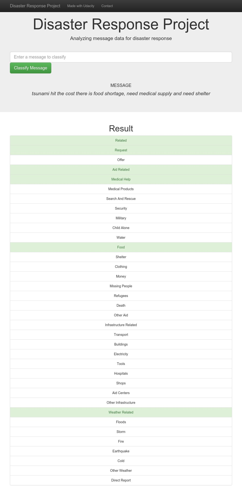

# Disaster Response Pipeline Project

### Project Motivation:

In this project, we have analyzed the disaster data from figure 8 and built a model for an API to classify the disaster messages. The data used are the real messages which are sent by the victims during the disaster events and this machine learning model categories the messages and send them to the relief agencies. I'm very much privileged to use this data and build an API for it, thanks to figure 8 and Udacity.

### File Structure:

	- app
	| - template
	| |- master.html  # main page of web app
	| |- go.html  # classification result page of web app
	|- run.py  # Flask file that runs app

	- data
	|- disaster_categories.csv  # data to process 
	|- disaster_messages.csv  # data to process
	|- process_data.py
	|- InsertDatabaseName.db   # database to save clean data to

	- models
	|- train_classifier.py
	|- classifier.pkl  # saved model 

	- README.md
    
### Instructions:
1. Run the following commands in the project's root directory to set up your database and model.

    - To run the ETL pipeline that cleans data and stores in the database
        `python data/process_data.py data/disaster_messages.csv data/disaster_categories.csv data/DisasterResponse.db`
    - To run ML pipeline that trains classifier and saves
        `python models/train_classifier.py data/DisasterResponse.db models/classifier.pkl`

2. Run the following command in the app's directory to run your web app.
    `python run.py`

3. Your web app should now be running if there were no errors. Now, open another Terminal window.
    Type
    `env|grep WORK`
    
  
4.  In a new web browser window, type in the following:

    https://SPACEID-3001.SPACEDOMAIN
    
    where SPACEID and SPACEDOMAIN are obtained in terminal o/p.
    
### Example 

Type the msg say for ex: Tsunami hit the coast, there is a food shortage, need medical supply and shelter

## Files

#### `data/disaster_categories.csv` , `data/disaster_messages.csv`

`disaster_categories.csv` contains the categories of each message. and the message dataset we use in this project is `disaster_messages.csv` which contains the message (translated and original) and genre of the message. 

#### `data/process_data.py`

It is used in the ETL process and stores the clean data in the SQL database

#### `models/train_classifier.py`

This py file contains the model for classifying the messages. Here we import the cleaned data from the SQL database and then perform some preprocessing steps and train it.

#### `app/run.py`

This executes the trained classifier and access to the database to portray data visy=ualisatiojns on the disaster response messages. We can change the template of the web site by changing the files in the template folder

---
